Итак, мы взяли 3 фотографии:
 
1. точный фейк (женщина с открытым ртом) 

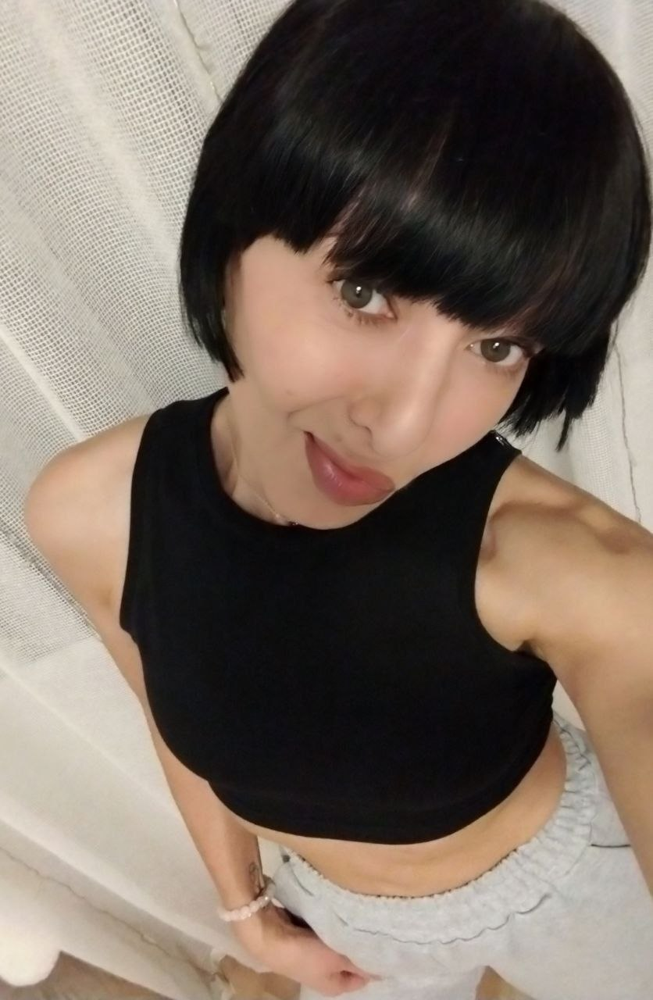

2. Реальную нефейковую фотографию  (женщина с закрытым ртом)

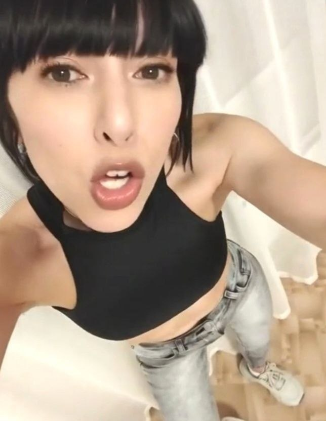

3. <??Неизвестно> (парни дурачатся в кафе)

 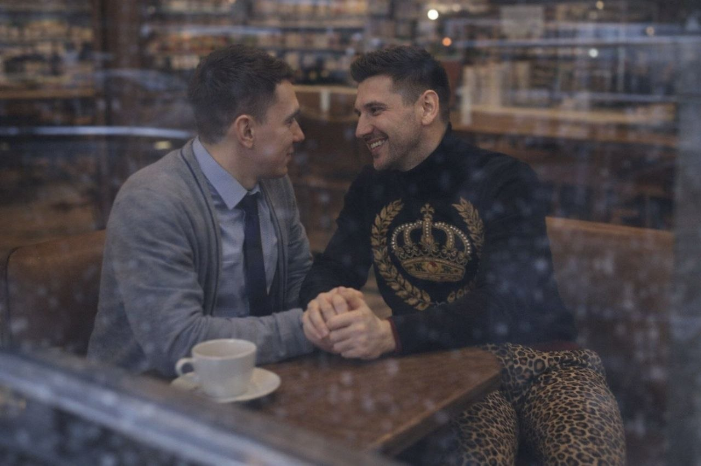

Закинули их в разные детекторы фейков  

# Decopy ai

[AI Image Detector Identify](https://decopy.ai/ai-image-detector/)

И вот какой результат мы получили:

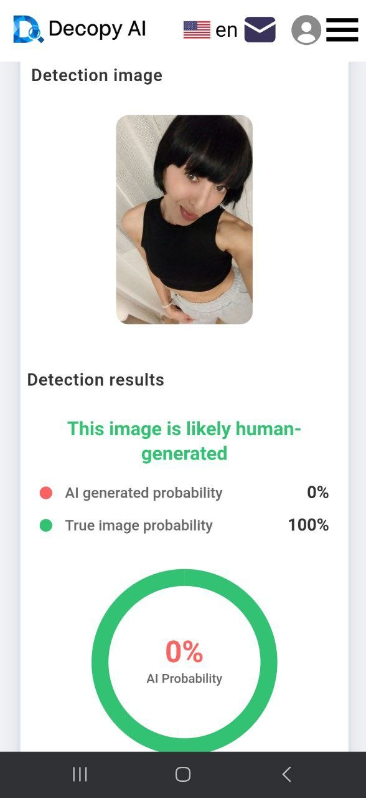
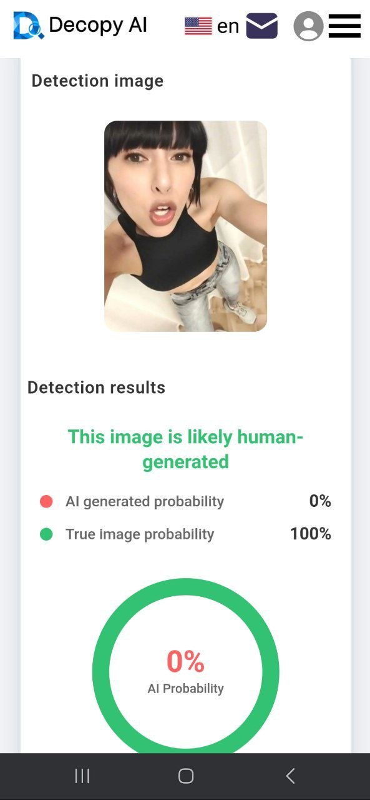
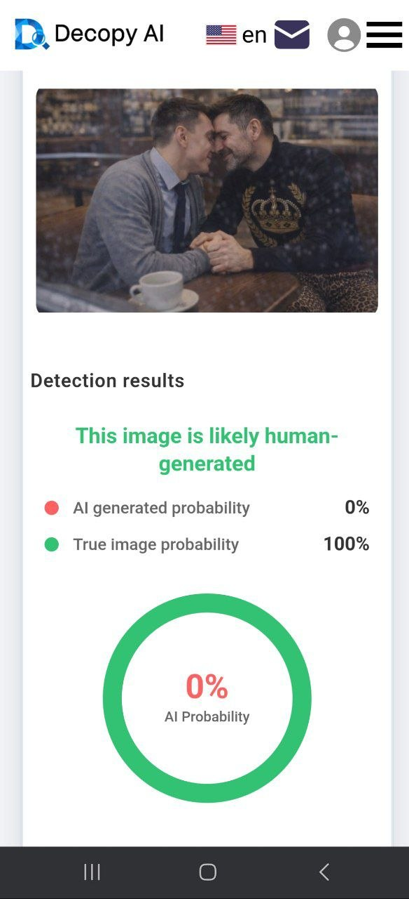

Какие выводы мы можем сделать на основе проведённого эксперимента?

Детектор идентифицировал все фотографии как нефейковые (не созданные с помощью ИИ), даже то, которое мы точно знаем что фейковое.

Какой вывод можем сделать, друзья?

Анька не шарит в прогах

Однозначно рекомендовать не можем😔

# Was it ai
Берем следующий детектор - [Was it ai](https://wasitai.com/) и теже самые фото
И вот какой результат мы получили:

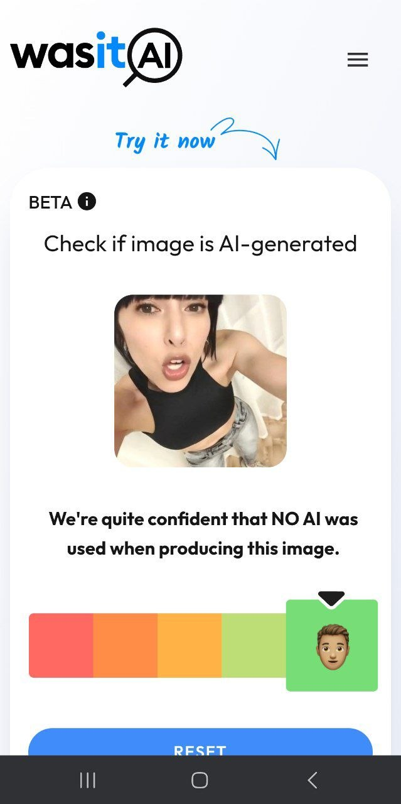
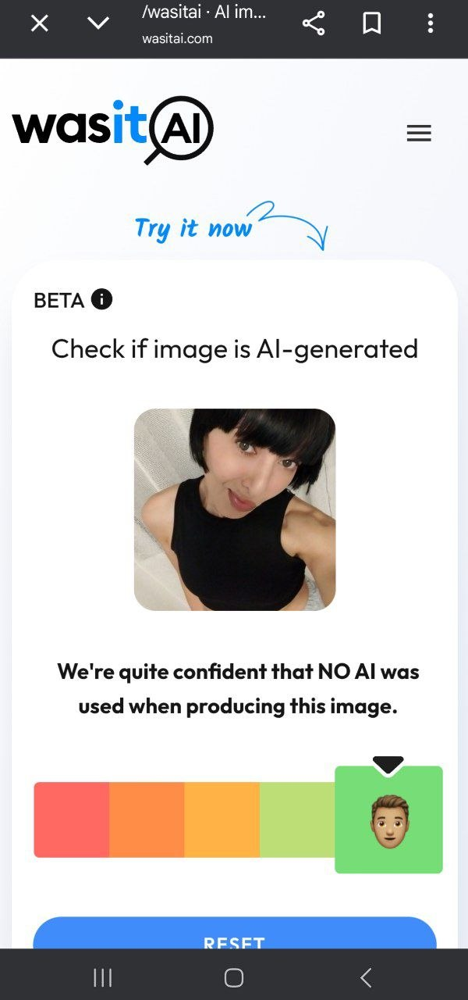
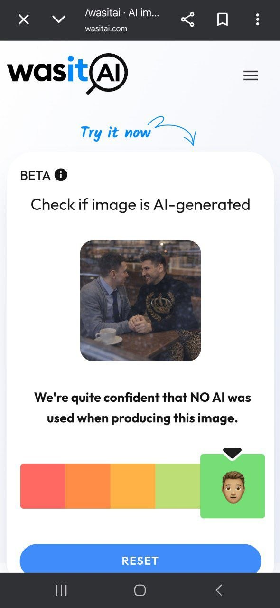

Какие выводы мы можем сделать на основе проведённого эксперимента?

Детектор идентифицировал все фотографии как нефейковые (не созданные с помощью ИИ), даже то, которое мы точно знаем что фейковое.

Какой вывод можем сделать, друзья?

Однозначно рекомендовать не можем, так же как и предыдущий 😔

Можем предположить что оба детектора не определили фейковую фотографию, потому что не умеют работать именно с дипфейками.

# hivedetect ai

Итак, тестируем третий детектор - [hivedetect ai](https://hivedetect.ai/). Мы взяли все те же 3 фотографии:
 
И вот какой результат мы получили:

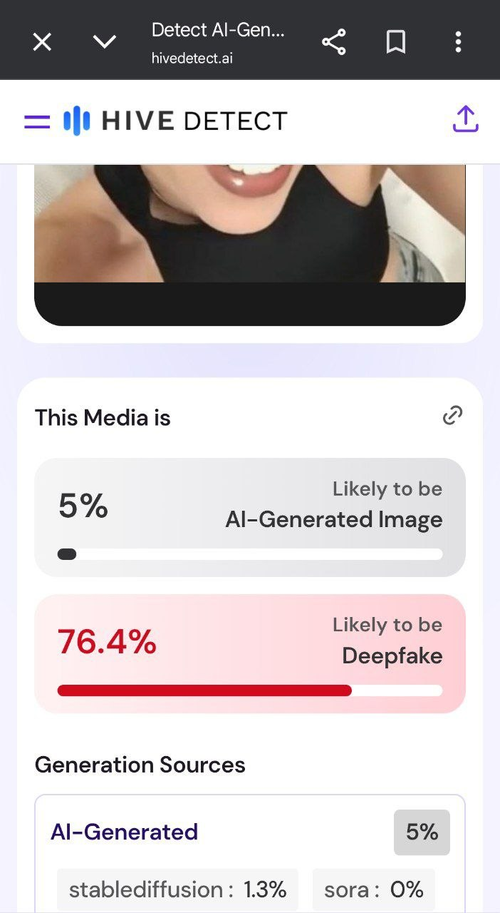
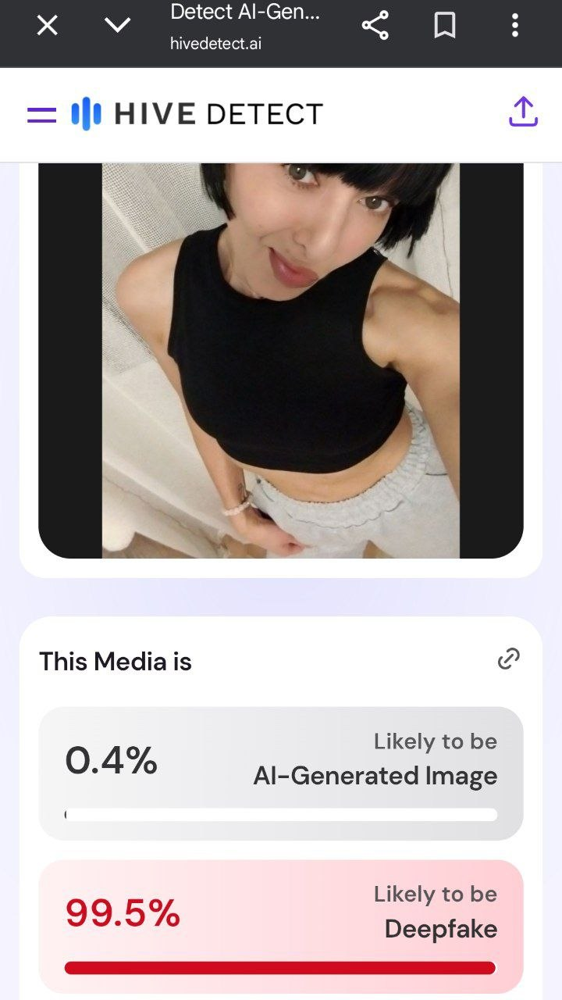
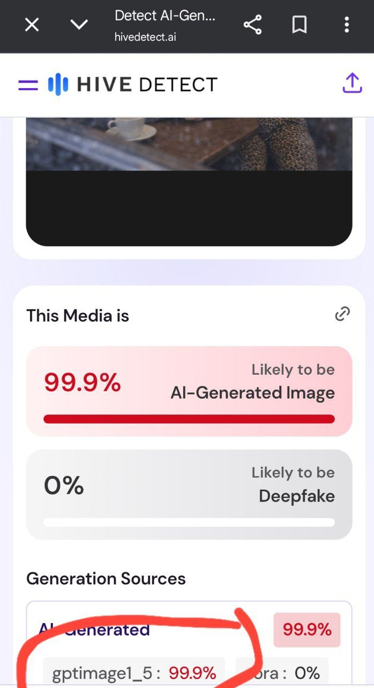

Какие выводы мы можем сделать на основе проведённого эксперимента?

Детектор идентифицировал обе фотографии с женщиной как фейковые (не созданные с помощью ИИ а с помощью дипфейка), даже то, которое мы точно знаем что нефейковое.
А фотографию с парнями как чистый ИИ (даже с указанием нейросети, которой оно было создано). Откроем секрет, мы изначально знали, что фотография с парнями является фейком, т.к. мы действительно сами создали её в chatgpt.

Какой вывод можем сделать, друзья?

100%-но умеет определять изображения сгенерированные ИИ. И умеет работать с дипфейками. 

# Conclusion
Открытым остаётся вопрос, почему он указал настоящую фотографию как дипфейк. 

Попробуем разобраться. Ведь о реальности фото мы знаем лишь со слов женщины, которая любезно нам предоставила свое фото.

Возьмём фотографию другого человека, например Анжелины Джоли

 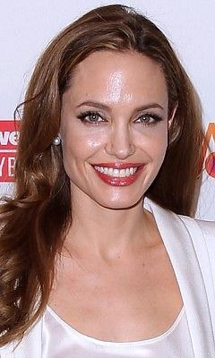

Детектор не выявил признаков ИИ и дипфейков,

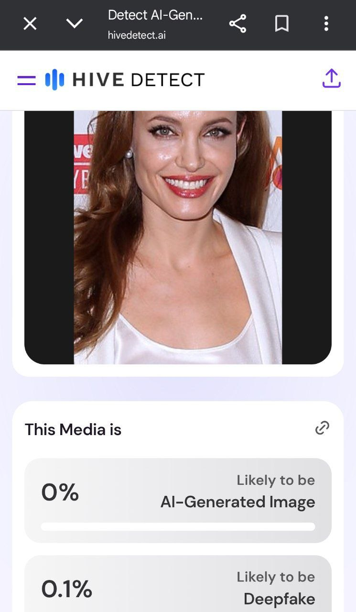

 потому что фотография реальна, она не студийная и без обработки. Детектор #1 и #2 предсказуемо тоже определили Джоли как реальную. Обратите внимание, даже несмотря на идеальные зубы, которые всем рисует ИИ, детектор не определил фото как фейк.

Стоит отметить, что выше указанный детектор сотрудничает с Министерством обороны США в сфере определения фейковой информации. И как мы лично убедились, не зря, т.к. выдал нам достойные результаты проверки.

Какой вывод можем сделать, друзья? 
